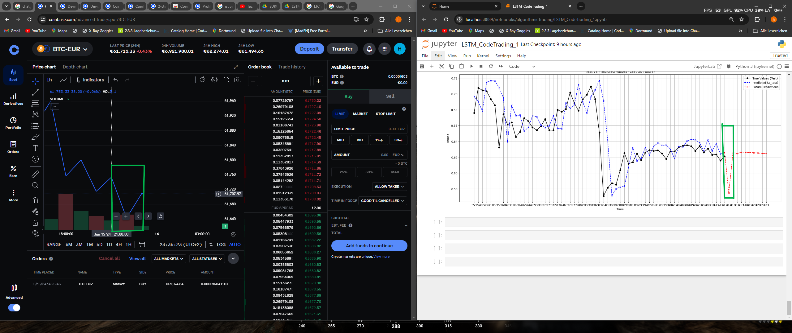
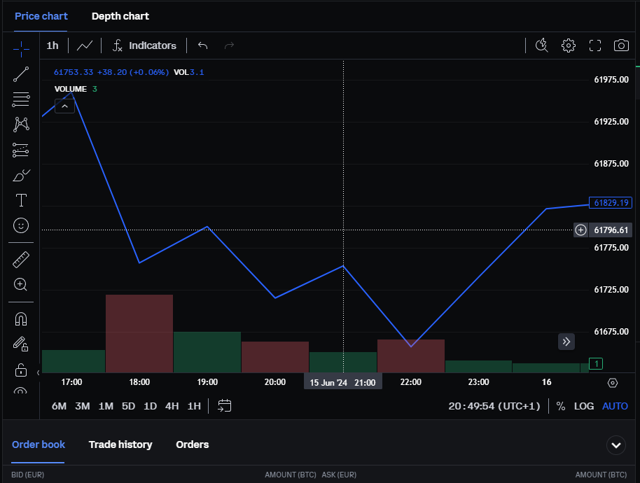
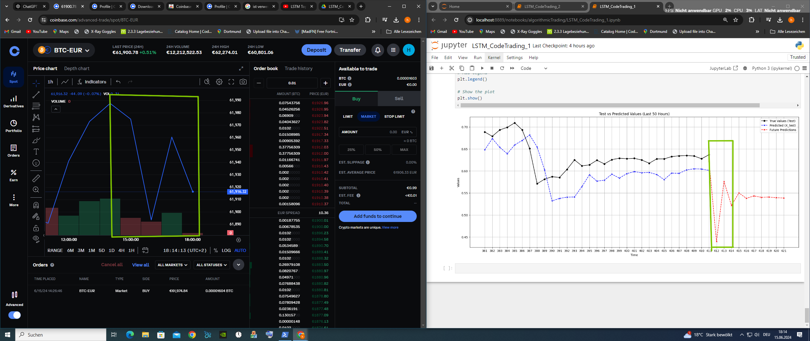

# LSTM-basierte Vorhersage für den Aktienhandel

## Übersicht
Dieses Notebook demonstriert die Verwendung eines Long Short-Term Memory (LSTM)-Netzwerks zur Vorhersage von Aktienhandels-Trends. Der Workflow umfasst die Datenvorverarbeitung, die Erstellung und das Training des Modells sowie die Visualisierung der Vorhersagen.

## Sehr Wichtig

.ipynb-Dateien können in GitHub nicht direkt angezeigt werden, da sie visuelle Darstellungen enthalten. Bitte verwenden Sie [nbviewer.org](https://nbviewer.org), um den Inhalt anzuzeigen.

## Funktionen
- **Datenladen und -vorverarbeitung**: Verarbeitung von Rohdaten aus dem Finanzbereich und deren Formatierung für Zeitreihenanalysen.
- **Training eines LSTM-Modells**: Aufbau und Training eines LSTM-Modells mit Keras/TensorFlow.
- **Vorhersagen und Visualisierung**:
  - Vorhersagen für Testdaten.
  - Vorhersagen zukünftiger Trends.
  - Visualisierung von echten und vorhergesagten Werten im Zeitverlauf.

## Voraussetzungen
- Python 3.7 oder neuer
- Wichtige Bibliotheken:
  - `numpy`
  - `pandas`
  - `matplotlib`
  - `yfinance`
  - `pandas_ta`
  - `tensorflow`
  - `scipy`
  - `sklearn`

## Hauptabschnitte
1. **Datenvorverarbeitung**:
   - Einlesen und Aufbereitung des Datensatzes für die Eingabe in das LSTM-Modell.
   - Skalierung und Aufteilung in Trainings- und Testdaten.

2. **Modellerstellung**:
   - Definition eines LSTM-Modells mit TensorFlow/Keras.
   - Kompilieren und Trainieren des Modells mit Hyperparameter-Anpassung.

3. **Vorhersagen und Evaluation**:
   - Bewertung des Modells auf ungesehenen Testdaten.
   - Generierung von Vorhersagen für Test- und zukünftige Datenpunkte.
   - Vergleich der vorhergesagten Werte mit den echten Werten durch Visualisierung.

4. **Visualisierung**:
   - Darstellung von echten vs. vorhergesagten Werten für die Testdaten.
   - Visualisierung zukünftiger Vorhersagen des LSTM-Modells.
  
# Vorhersage-Modell mit yfinance-Daten

## Überblick

Das Modell nutzt **yfinance**, um Finanzdaten abzurufen und Vorhersagen zu erstellen. Allerdings stellt **yfinance** Daten immer nur bis **zwei Stunden vor der aktuellen Stunde** bereit. Das bedeutet beispielsweise, dass um **14:00 Uhr** nur Daten bis **10:00 Uhr** verfügbar sind.

## Visualisierung

Die Vorhersagen und die tatsächlichen Werte werden in einem Diagramm dargestellt, das drei Linien mit unterschiedlichen Farben zeigt:

- **Schwarze Linie**: Repräsentiert die **tatsächlichen Werte** (echte historische Daten).
- **Blau gestrichelte Linie**: Stellt die **Vorhersage des Modells** dar.
- **Rote Linie**: Zeigt die **zukünftige Vorhersage** des Modells.

### Grüne Box

Die Informationen innerhalb der **grünen Box** heben die **zukünftigen Vorhersagen** hervor.

## Hinweis

Durch die zeitliche Einschränkung der verfügbaren Daten können aktuelle Werte, die näher an der Gegenwart liegen, nicht berücksichtigt werden. Die Diagramme sollen trotzdem helfen, die Genauigkeit des Modells im Vergleich zu den tatsächlichen Werten zu beurteilen.

## Beispiel für die Visualisierung
Das folgende Diagramm zeigt einen Vergleich der echten Werte und der Vorhersagen des LSTM-Modells:

Im angefügten Bild sind Daten bis **24.06.15, 21:00 Uhr** verfügbar. Diese zeitliche Begrenzung der Daten ist im Diagramm sichtbar und verdeutlicht, wie das Modell mit der Einschränkung umgeht.

Da der oben gezeigte Chart nicht vollständig ist, hier die aktuelle Version vom 24.06.15 um 21:00 Uhr

Ich nehme normalerweise nur die ersten zwei Stunden ernst, das heißt, ich betrachte die Daten bis 14:00 Uhr. Das Modell erstellt jedoch Vorhersagen für 10 Stunden, von denen ich nur die ersten zwei Stunden berücksichtige, da die restlichen 90 % der Vorhersagen oft ungenau sind. Im Vergleich kann man jedoch sehen, dass mehr als zwei Stunden korrekt waren.

Im angefügten Bild sind Daten bis **24.06.15, 14:00 Uhr** verfügbar. Diese zeitliche Begrenzung der Daten ist im Diagramm leider nicht sehr sichtbar.

