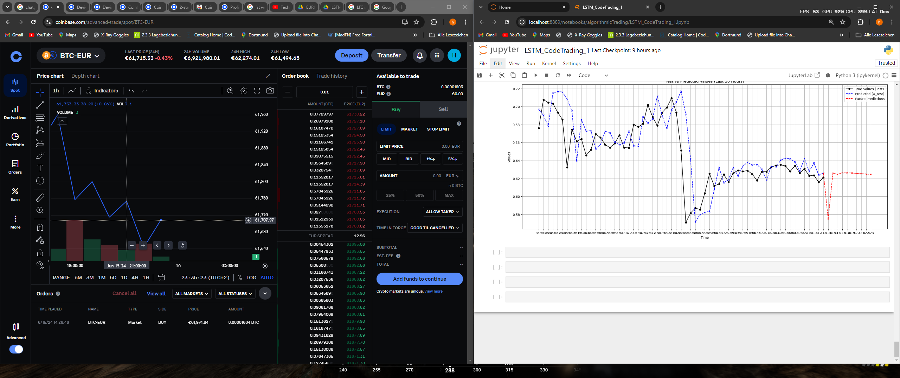

# LSTM-basierte Vorhersage für den Aktienhandel

## Übersicht
Dieses Notebook demonstriert die Verwendung eines Long Short-Term Memory (LSTM)-Netzwerks zur Vorhersage von Aktienhandels-Trends. Der Workflow umfasst die Datenvorverarbeitung, die Erstellung und das Training des Modells sowie die Visualisierung der Vorhersagen.

## Funktionen
- **Datenladen und -vorverarbeitung**: Verarbeitung von Rohdaten aus dem Finanzbereich und deren Formatierung für Zeitreihenanalysen.
- **Training eines LSTM-Modells**: Aufbau und Training eines LSTM-Modells mit Keras/TensorFlow.
- **Vorhersagen und Visualisierung**:
  - Vorhersagen für Testdaten.
  - Vorhersagen zukünftiger Trends.
  - Visualisierung von echten und vorhergesagten Werten im Zeitverlauf.

## Voraussetzungen
- Python 3.7 oder neuer
- Wichtige Bibliotheken:
  - `numpy`
  - `pandas`
  - `matplotlib`
  - `tensorflow`
  - `scipy`
  - `sklearn`

## Hauptabschnitte
1. **Datenvorverarbeitung**:
   - Einlesen und Aufbereitung des Datensatzes für die Eingabe in das LSTM-Modell.
   - Skalierung und Aufteilung in Trainings- und Testdaten.

2. **Modellerstellung**:
   - Definition eines LSTM-Modells mit TensorFlow/Keras.
   - Kompilieren und Trainieren des Modells mit Hyperparameter-Anpassung.

3. **Vorhersagen und Evaluation**:
   - Bewertung des Modells auf ungesehenen Testdaten.
   - Generierung von Vorhersagen für Test- und zukünftige Datenpunkte.
   - Vergleich der vorhergesagten Werte mit den echten Werten durch Visualisierung.

4. **Visualisierung**:
   - Darstellung von echten vs. vorhergesagten Werten für die Testdaten.
   - Visualisierung zukünftiger Vorhersagen des LSTM-Modells.

## Anleitung zur Ausführung
1. Stelle sicher, dass die benötigten Bibliotheken installiert sind:
   ```bash
   pip install numpy pandas matplotlib tensorflow

## Beispiel für die Visualisierung
Das folgende Diagramm zeigt einen Vergleich der echten Werte und der Vorhersagen des LSTM-Modells:




